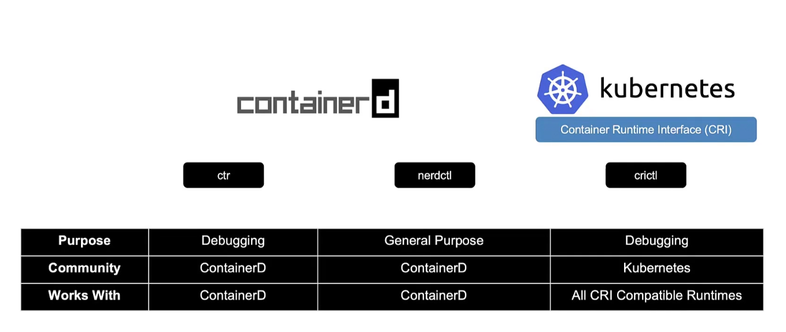

kubectl cluster-info #to get cluster details
kubectl get nodes #to get nodes

Tools to interact with container in kube ctr, nerdctl, crictl

CRI (container runtime interface) alloed any container to run on kubernetes who follows oci standards

oci(Open container initiative) standards contains image spec and runtimespec

dockershim was introduced to support docker in kubernetes

containerd follows oci and so docker can be used without docker shim

containerd is made opensource so any conatiner provider can uses containerd. so in nodes we only need to install containeD as runtime

ctr is a cli tool bundled with containerD and its not user friendlys so we can use cli tool like nerdCTL

nerdctl is built specifically for containerd

nerdctl supports
 - encrypted container images
 - Lazy pulling of images
 - p2p imge distribution
 - image signing and verification
 - namespaces in kubernetes
 - supports docker compose

 crictl for compatible container runtime for (CRI)
 used to inspect containers
 crictl is aware of pods

 